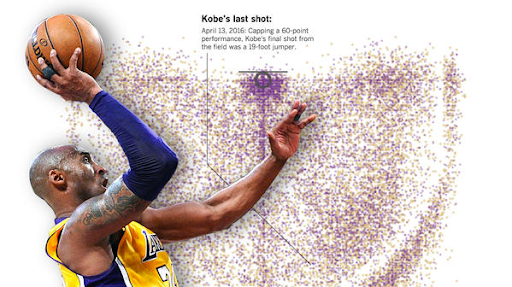
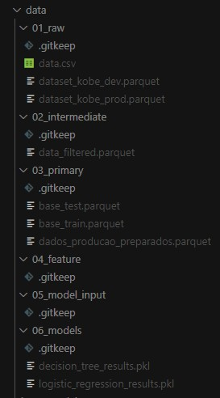

# Matéria: Engenharia de Machine Learning [25E1_3]
## Aluno: Eder Jani Martins
## Data: 07/03/2025

## Projeto disponível no Github

[https://github.com/edermartins/ia-lab/tree/main/machine_learning_engineering/kobe](https://github.com/edermartins/ia-lab/tree/main/machine_learning_engineering/kobe)


# Descrição do Projeto

Nesse momento, iremos validar todo nosso conhecimento sobre Engenharia de Machine Learning. Nós aprendemos neste curso a desenvolver coleta de dados, criar pipelines para processamento, adaptar modelos para operação e estabelecer métodos de atualização. Para tal, vimos conceitos como AutoML, MLOps, Visualização de Dados e estrutura de projetos. As questões a seguir irão abordar esses temas.

Para iniciar esta tarefa, baixe os dados que estão [localizados nesse link](https://www.kaggle.com/c/kobe-bryant-shot-selection/data). Esses são os dados dos arremessos realizados pelo astro da NBA Kobe Bryant durante sua carreira.


> **FIG 1**: Imagem retirada de: https://graphics.latimes.com/kobe-every-shot-ever/

# Enunciado

1. A solução criada nesse projeto deve ser disponibilizada em repositório git e disponibilizada em servidor de repositórios (Github (recomendado), Bitbucket ou Gitlab). O projeto deve obedecer o Framework TDSP da Microsoft (estrutura de arquivos, arquivo requirements.txt e arquivo README - com as respostas pedidas nesse projeto, além de outras informações pertinentes). Todos os artefatos produzidos deverão conter informações referentes a esse projeto (não serão aceitos documentos vazios ou fora de contexto). Escreva o link para seu repositório. 
> Em acordo com o professor Felipe Fink Grael, usaremos o padrão de pasta do Kedro
>
> Estrutura disponível no [github](https://github.com/edermartins/ia-lab/tree/main/machine_learning_engineering/kobe)


2. Iremos desenvolver um preditor de arremessos usando duas abordagens (regressão logística e classificação) para prever se o "Black Mamba" (apelido de Kobe) acertou ou errou a cesta.

    Baixe os dados de desenvolvimento e produção [aqui](https://github.com/tciodaro/eng_ml/tree/main/data) (datasets: `dataset_kobe_dev.parquet` e `dataset_kobe_prod.parquet`). Salve-os numa pasta `/data/raw` na raiz do seu repositório.
    > Os arquivos estão na pasta `data/01_raw`

    Para começar o desenvolvimento, desenhe um diagrama que demonstra todas as etapas necessárias para esse projeto, desde a aquisição de dados, passando pela criação dos modelos, indo até a operação do modelo.

3. Como as ferramentas Streamlit, MLFlow, PyCaret e Scikit-Learn auxiliam na construção dos pipelines descritos anteriormente? A resposta deve abranger os seguintes aspectos:
    * a. Rastreamento de experimentos;
    * b. Funções de treinamento;
    * c. Monitoramento da saúde do modelo;
    * d. Atualização de modelo;
    * f. Provisionamento (Deployment).

4. Com base no diagrama realizado na questão 2, aponte os artefatos que serão criados ao longo de um projeto. Para cada artefato, a descrição detalhada de sua composição.

5. Implemente o pipeline de processamento de dados com o mlflow, rodada (run) com o nome "PreparacaoDados":
* a. Os dados devem estar localizados em "`/data/raw/dataset_kobe_dev.parquet`" e "`/data/raw/dataset_kobe_prod.parquet`" 
* b. Observe que há dados faltantes na base de dados! As linhas que possuem dados faltantes devem ser desconsideradas. Para esse exercício serão apenas consideradas as colunas: 
  * i. lat
  * ii. lon
  * iii. minutes_remaining
  * iv. period
  * v. playoffs
  * vi. shot_distance

      A variável `shot_made_flag` será seu alvo, onde 0 indica que Kobe errou e 1 que a cesta foi realizada. O dataset resultante será armazenado na pasta "`/data/processed/data_filtered.parquet`". Ainda sobre essa seleção, qual a dimensão resultante do dataset?

  * vii. Separe os dados em treino (80%) e teste (20 %) usando uma escolha aleatória e estratificada. Armazene os datasets resultantes em "/Data/processed/base_{train|test}.parquet . Explique como a escolha de treino e teste afetam o resultado do modelo final. Quais estratégias ajudam a minimizar os efeitos de viés de dados.
  * viii. Registre os parâmetros (% teste) e métricas (tamanho de cada base) no MlFlow

6. Implementar o pipeline de treinamento do modelo com o MlFlow usando o nome "Treinamento"
   * a. Com os dados separados para treinamento, treine um modelo com regressão logística do sklearn usando a biblioteca pyCaret.
   * b. Registre a função custo "log loss" usando a base de teste
   * c. Com os dados separados para treinamento, treine um modelo de árvore de decisão do sklearn usando a biblioteca pyCaret.
   * d. Registre a função custo "log loss" e F1_score para o modelo de árvore.
   * e. Selecione um dos dois modelos para finalização e justifique sua escolha.

7. Registre o modelo de classificação e o sirva através do MLFlow (ou como uma API local, ou embarcando o modelo na aplicação). Desenvolva um pipeline de aplicação (`aplicacao.py`) para carregar a base de produção (`/data/raw/dataset_kobe_prod.parquet`) e aplicar o modelo. Nomeie a rodada (run) do mlflow como "PipelineAplicacao" e publique, tanto uma tabela com os resultados obtidos (artefato como `.parquet`), quanto log as métricas do novo log loss e f1_score do modelo.
   * a. O modelo é aderente a essa nova base? O que mudou entre uma base e outra? Justifique.
   * b. Descreva como podemos monitorar a saúde do modelo no cenário com e sem a disponibilidade da variável resposta para o modelo em operação.
   * c. Descreva as estratégias reativa e preditiva de retreinamento para o modelo em operação.

8. Implemente um dashboard de monitoramento da operação usando Streamlit.

____
# Sessão com as respostas
Nesta sessão estão as soluções dos enunciados e as rúbricas solicitadas.

## Descrições do Dataset

A base de dados contém informações sobre os arremessos realizados por Kobe Bryant (Black Mamba), jogador da NBA. Abaixo está a descrição dos campos disponíveis na base de dados (baseado em deduções e pesquisas no Kaggle, nem todos os campos são óbvios):

| Campo | Tipo | Descrição |
|-------|------|-----------|
| action_type | string | Tipo de ação do arremesso (ex: "Jump Shot", "Dunk", "Layup") |
| combined_shot_type | string | Tipo combinado do arremesso (ex: "Jump Shot", "Dunk", "Layup", "Hook Shot") |
| game_event_id | integer | ID único do evento no jogo |
| game_id | integer | ID único do jogo |
| lat | float | Latitude da posição do arremesso |
| loc_x | integer | Coordenada X da posição do arremesso |
| loc_y | integer | Coordenada Y da posição do arremesso |
| lon | float | Longitude da posição do arremesso |
| minutes_remaining | integer | Minutos restantes no período |
| period | integer | Período do jogo (1-4 para tempo regular, 5+ para prorrogação) |
| playoffs | integer | Indicador se o jogo é de playoffs, fase eliminatória da temporada (0 = não, 1 = sim) |
| season | string | Temporada do jogo (ex: "1996-97") |
| seconds_remaining | integer | Segundos restantes no período |
| shot_distance | float | Distância do arremesso em pés |
| shot_made_flag | integer | Resultado do arremesso (0 = errou, 1 = acertou) |
| shot_type | string | Tipo do arremesso (2 pontos "2PT Field Goal" ou 3 pontos "3PT Field Goal") |
| shot_zone_area | string | Área da quadra onde o arremesso foi realizado |
| shot_zone_basic | string | Área básica da quadra (ex: "Mid-Range", "In The Paint") |
| shot_zone_range | string | Faixa de distância do arremesso |
| team_id | integer | ID do time |
| team_name | string | Nome do time |
| game_date | string | Data do jogo |
| matchup | string | Confronto, código do time do Kobe vs código do time adversário (ex: "LAL vs. GSW") |
| opponent | string | Time adversário |
| shot_id | integer | ID único do arremesso |


# Template de Rubrica para ser utilizado com a extensão Rubricator

1. Desenvolver um sistema de coleta de dados usando APIs públicas
* O aluno categorizou corretamente os dados?
> [Ver](#descrições-do-dataset)
* O aluno integrou a leitura dos dados corretamente à sua solução?
* O aluno aplicou o modelo em produção (servindo como API ou como solução embarcada)?
* O aluno indicou se o modelo é aderente a nova base de dados?

2. Criar uma solução de streaming de dados usando pipelines
* O aluno criou um repositório git com a estrutura de projeto baseado no Framework TDSP da Microsoft?
> Em acordo com o professor foi utilizado o padrão Kedro e está disponível na sessão [Projeto disponível no Github](#projeto-disponível-no-github)
* O aluno criou um diagrama que mostra todas as etapas necessárias para a criação de modelos?
* O aluno treinou um modelo de regressão usando PyCaret e MLflow?
> Foi criado no pipeline [Treinamento](https://github.com/edermartins/ia-lab/tree/main/machine_learning_engineering/kobe/src/kobe/pipelines/treinamento)
* O aluno calculou o Log Loss para o modelo de regressão e registrou no mlflow?
> Foi criado no pipeline [Treinamento](https://github.com/edermartins/ia-lab/tree/main/machine_learning_engineering/kobe/src/kobe/pipelines/treinamento)
* O aluno treinou um modelo de árvore de decisao usando PyCaret e MLflow?
> Foi criado no pipeline [Treinamento](https://github.com/edermartins/ia-lab/tree/main/machine_learning_engineering/kobe/src/kobe/pipelines/treinamento)
* O aluno calculou o Log Loss e F1 Score para o modelo de árvore de decisão e registrou no mlflow?
> Foi criado no pipeline [Treinamento](https://github.com/edermartins/ia-lab/tree/main/machine_learning_engineering/kobe/src/kobe/pipelines/treinamento)

3. Preparar um modelo previamente treinado para uma solução de streaming de dados
* O aluno indicou o objetivo e descreveu detalhadamente cada artefato criado no projeto?
* O aluno cobriu todos os artefatos do diagrama proposto?
* O aluno usou o MLFlow para registrar a rodada "Preparação de Dados" com as métricas e argumentos relevantes?
> Pode ser visto no arquivo `nodes.py` do pipeline [Preparação do Dados](https://github.com/edermartins/ia-lab/tree/main/machine_learning_engineering/kobe/src/kobe/pipelines/preparacao_dados)
* O aluno removeu os dados faltantes da base?
> Pode ser visto no arquivo `nodes.py` do pipeline [Preparação do Dados](https://github.com/edermartins/ia-lab/tree/main/machine_learning_engineering/kobe/src/kobe/pipelines/preparacao_dados)
* O aluno selecionou as colunas indicadas para criar o modelo?
> Pode ser visto no arquivo `nodes.py` do pipeline [Preparação do Dados](https://github.com/edermartins/ia-lab/tree/main/machine_learning_engineering/kobe/src/kobe/pipelines/preparacao_dados)
* O aluno indicou quais as dimensões para a base preprocessada?
* O aluno criou arquivos para cada fase do processamento e os armazenou nas pastas indicadas?
> Os arquivos de código e configuração podem ser vista no projeto do Github, mas os arquivos gerados não vão para o repositório mas se o projeto for executado os dados serão gerados. Mas segue uma imagem demostrando minha pasta:

* O aluno separou em duas bases, uma para treino e outra para teste?
* O aluno criou um pipeline chamado "Treinamento" no MlFlow?

4. Estabelecer um método de como atualizar o modelo empregado em produção
* O aluno identificou a diferença entre a base de desenvolvimento e produção?
>
* O aluno descreveu como monitorar a saúde do modelo no cenário com e sem a disponibilidade da variável alvo?
* O aluno implementou um dashboard de monitoramento da operação usando Streamlit?
* O aluno descreveu as estratégias reativa e preditiva de retreinamento para o modelo em operação?

____
# Kedro Generated

[](https://kedro.org)

## Overview

This is your new Kedro project with Kedro-Viz setup, which was generated using `kedro 0.19.11`.

Take a look at the [Kedro documentation](https://docs.kedro.org) to get started.

## Rules and guidelines

In order to get the best out of the template:

* Don't remove any lines from the `.gitignore` file we provide
* Make sure your results can be reproduced by following a [data engineering convention](https://docs.kedro.org/en/stable/faq/faq.html#what-is-data-engineering-convention)
* Don't commit data to your repository
* Don't commit any credentials or your local configuration to your repository. Keep all your credentials and local configuration in `conf/local/`

## How to install dependencies

Declare any dependencies in `requirements.txt` for `pip` installation.

To install them, run:

```
pip install -r requirements.txt
```

## How to run your Kedro pipeline

You can run your Kedro project with:

```
kedro run
```

## How to test your Kedro project

Have a look at the files `src/tests/test_run.py` and `src/tests/pipelines/data_science/test_pipeline.py` for instructions on how to write your tests. Run the tests as follows:

```
pytest
```

To configure the coverage threshold, look at the `.coveragerc` file.

## Project dependencies

To see and update the dependency requirements for your project use `requirements.txt`. Install the project requirements with `pip install -r requirements.txt`.

[Further information about project dependencies](https://docs.kedro.org/en/stable/kedro_project_setup/dependencies.html#project-specific-dependencies)

## How to work with Kedro and notebooks

> Note: Using `kedro jupyter` or `kedro ipython` to run your notebook provides these variables in scope: `catalog`, `context`, `pipelines` and `session`.
>
> Jupyter, JupyterLab, and IPython are already included in the project requirements by default, so once you have run `pip install -r requirements.txt` you will not need to take any extra steps before you use them.

### Jupyter
To use Jupyter notebooks in your Kedro project, you need to install Jupyter:

```
pip install jupyter
```

After installing Jupyter, you can start a local notebook server:

```
kedro jupyter notebook
```

### JupyterLab
To use JupyterLab, you need to install it:

```
pip install jupyterlab
```

You can also start JupyterLab:

```
kedro jupyter lab
```

### IPython
And if you want to run an IPython session:

```
kedro ipython
```

### How to ignore notebook output cells in `git`
To automatically strip out all output cell contents before committing to `git`, you can use tools like [`nbstripout`](https://github.com/kynan/nbstripout). For example, you can add a hook in `.git/config` with `nbstripout --install`. This will run `nbstripout` before anything is committed to `git`.

> *Note:* Your output cells will be retained locally.

[Further information about using notebooks for experiments within Kedro projects](https://docs.kedro.org/en/develop/notebooks_and_ipython/kedro_and_notebooks.html).
## Package your Kedro project

[Further information about building project documentation and packaging your project](https://docs.kedro.org/en/stable/tutorial/package_a_project.html).
